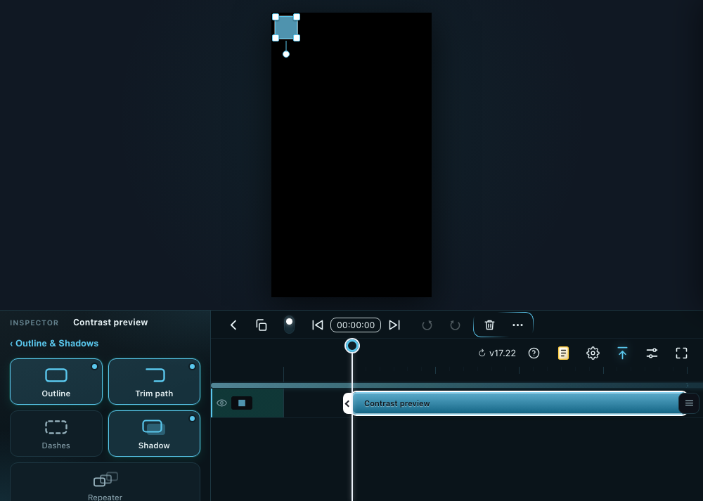

# #1025 glass-theme faint text contrast

Starting commit: `e1f452a2033ea2a4fc8747263909a5f9917c2a95` on isolated `codex/690-batch2-theme-contrast`.

The shared dark-glass faint text changes from `#63808c` to `#7795a2`; the light settings override changes from `#7d8798` to `#66707f`. Glass-theme shortcut numerals no longer add an extra 20% opacity reduction. Their contrast on the card changes from about 3.06:1 to 5.35:1; the corrected token also clears 4.5:1 on the panel's brighter hover surface. Light settings faint text moves from 3.44:1 to 4.75:1 on `#f7f9fc`.

Actual editor screenshots from the same fixture and viewport, before and after:

Changed files: `theme-glass.css`, `index.html` (theme cache 67→68), `tests/tests.js` (one focused `{ item: 'TBD' }` regression), the two screenshot assets, and this report.

Checks: focused Chromium contrast regression passed using computed colour and opacity composited over the card, hover and light settings surfaces. Node syntax and diff checks passed. Captures and test ran in isolated local browsers; no collaboration or full-suite test ran. This commit remains staged behind #1019/#1020 collaboration browser checks; it is not in the preferred reviewed branch yet.
