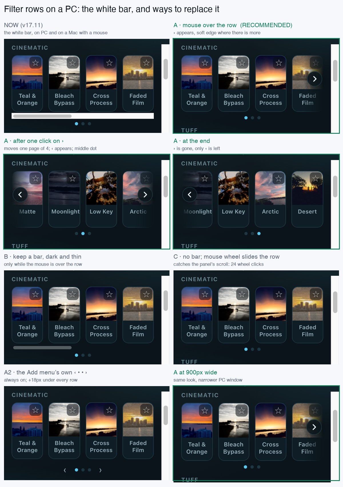
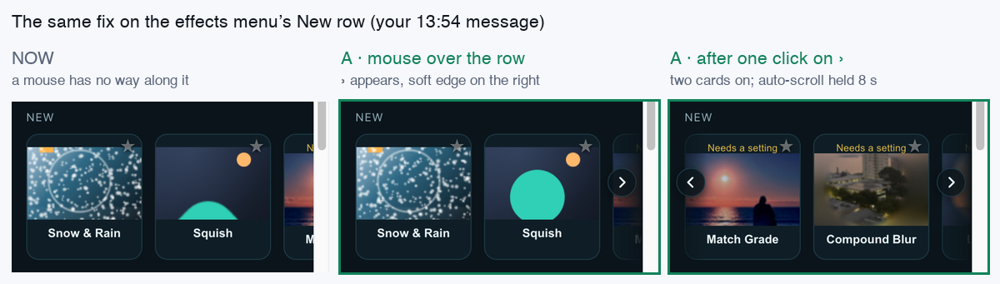
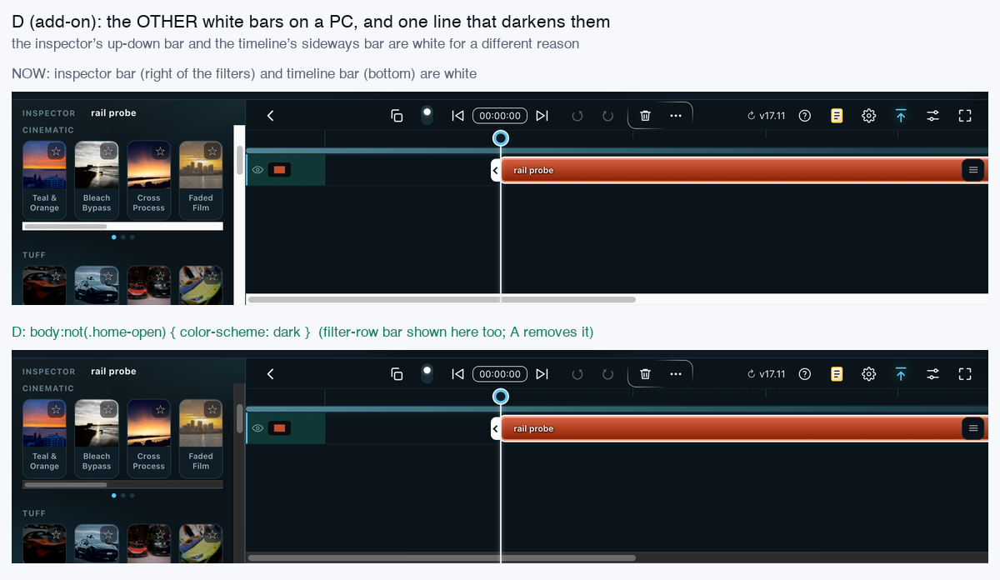

# The white slider bar on PC (filter rows), and the New row a mouse cannot slide. Plan for the builder

Written by the planning chat on 28 Sep. Nothing in the repo was edited. Every file named `PLAN/…` is in
`/Users/ezrasmith/Claude/FreeMotion/tools/design/plans/2026-09-28-rail-scrollbar/`.
Measured against v17.11 (HEAD 2d06a3f5), in Chrome 153 through `tools/shot.py`. The desktop shots are the Studio layout,
which has been the only desktop layout since queue 293.

## 0. The short version

- **The cause is confirmed.** On a desktop pointer, `styles.css` 7809–7813 sets `.flt-grid { scrollbar-width: thin }`,
  and then styles `::-webkit-scrollbar` to be a dark 6px bar.
  - Since Chrome 121, setting the standard `scrollbar-width` turns the `::-webkit-scrollbar*` rules off for that
    element. So the dark thumb never applied, and Chrome drew its own light bar: an 11px white track with a grey thumb.
  - Same element, three settings (§2): `thin` gives 11px, light. `auto` gives the intended 6px dark bar. Setting
    `scrollbar-color` again gives 15px, light.
  - The app never declares `color-scheme: dark` (the computed value is `normal`), so every native bar is painted in the
    light scheme.
- **Why "sometimes on Mac".** This Mac's "Show scroll bars" is on Automatic (`AppleShowScrollBars` is unset).
  - With only a trackpad, macOS uses overlay bars. They take 0px and only appear while scrolling, so there is no white bar.
  - With a mouse plugged in, macOS switches to classic bars, and the white bar appears.
  - Measured: overlay = 0px; forced classic = 11px white.
- **His read is right.** The bar only exists because a wheel mouse cannot scroll sideways.
- **Recommended fix: A.** No bar anywhere. When the mouse is over a row, a round ‹ or › shows at that row's end, only on a
  side that has more, over a soft fade on that side. One click moves one page of whole tiles.
  - The #565 dots stay.
  - Swipe, trackpad and shift+wheel are untouched.
  - The phone is unchanged, measured at 380.
  - One small shared helper (`js/rail-arrows.js`) also fixes his 13:54 message: the effects menu's **New** row, which a
    mouse cannot move at all today.
- **Proof.**
  - The two new synthetic tests FAIL on HEAD and PASS with A injected, at 900 and at 1920.
  - Queue 565's and 463's existing tests PASS on both.
  - Five single-point mutations of A are each CAUGHT (§7).
- **Also found (his call).**
  - The template screen's slot row ("Insert your Media") has the same white bar once a template has 8+ slots. Measured:
    15px. The same helper fixes it.
  - The inspector's and the timeline's own bars are white on PC too, for the colour-scheme reason. One CSS line (D)
    darkens them. Measured: the only visible change is the bars.

## 1. His words (verbatim) and his clauses

> "On pc to slide through the filter menus theres a white slider bar that looks really tacky, and it shows up on mac sometimes too, i think this stemmed from the main use of sliding being trackerpad"

1. On PC, the filter menus' sideways rows show a white scrollbar that looks tacky.
2. It sometimes shows on Mac too.
3. His read: sliding was designed for a trackpad.

And one minute later (INBOX 13:54). The logger asked for both to be planned together:

> "also on pc without trackpad there seems to be no way to slide the new section in effects menu"

4. On a PC with a mouse, the effects menu's New row cannot be slid at all.

| Clause | Answered by |
|---|---|
| 1 | §2 cause, §6 fix A (no native bar on any filter row) |
| 2 | §2.3 (the macOS Automatic setting). A removes the bar, so a Mac with a mouse shows nothing either |
| 3 | §0. The fix gives a mouse its own control rather than a bar |
| 4 | §6.4, the same helper on `.fxb-featured` (effects AND audio browsers) |

## 2. The cause, with evidence

### 2.1 The rule (styles.css, v17.11)

```css
7807  /* A desktop pointer has no swipe, so the rail keeps a visible bar there — … */
7809  @media (hover: hover) and (pointer: fine) {
7810    .flt-grid { scrollbar-width: thin; }
7811    .flt-grid::-webkit-scrollbar { display: block; height: 6px; }
7812    .flt-grid::-webkit-scrollbar-thumb { background: var(--line); border-radius: 3px; }
7813  }
```

### 2.2 Measured: one element, three settings (`PLAN/scene-measure.js`, 1280×900, classic bars)

| Setting on a Cinematic row | Bar | What it looks like |
|---|---|---|
| as shipped (`scrollbar-width: thin`) | **11px** | light track, grey thumb (the white bar) |
| inline `scrollbar-width: auto` | **6px** | the intended `::-webkit` bar, a `var(--line)` thumb |
| `auto` plus `scrollbar-color: red blue` | **15px** | `::-webkit` ignored again |

This is documented Chrome behaviour, not just a measurement: since Chrome 121, if an element's computed
`scrollbar-width` or `scrollbar-color` is anything other than `auto`, its `::-webkit-scrollbar*` styling is ignored
([Chrome for Developers, "Scrollbar styling"](https://developer.chrome.com/docs/css-ui/scrollbar-styling);
[Frontend Masters, "Chrome is supporting the standard now, which overrides the old pseudo elements"](https://frontendmasters.com/blog/heads-up-on-custom-scrollbars-chrome-is-supporting-the-standard-now-which-overrides-the-old-pseudo-elements/)).
The `auto` row above is that rule seen from the other side.

`getComputedStyle(document.documentElement).colorScheme` is `normal`. Nothing in `styles.css` declares
`color-scheme: dark`; only the light Home's Settings scrim declares `light`. So a native bar is always the light one.

### 2.3 Headless, overlay bars, and forcing classic bars

- **Default headless run on this Mac:** every row read `offsetHeight − clientHeight = 0`. These are overlay bars, not
  painted at rest, so a plain shot shows no bar.
- **`PLAN/shot_classic.py`** is `tools/shot.py` unchanged, with `-AppleShowScrollBars Always` added to Chrome's command
  line.
  - Cocoa reads `-Key Value` pairs into the per-process argument domain, so no system setting is touched.
  - Chrome also reads the stray `Always` as its one start URL. Headless allows only one, so it replaces `about:blank`,
    and shot.py navigates that tab straight to the app.
  - With it, every overflowing filter row reads **11px**, and the shot shows the white bar in NOW of
    `rail-options.png`. That is his picture.
  - `FM_CLASSIC_BARS=0` turns it off. `FM_DSF=2` renders a desktop width at 2x for crisp crops.
- **Windows' own pixels are UNMEASURED**, because there is no Windows machine here. Chrome on Windows draws the same
  light-scheme native bar in the same situation (a set `scrollbar-width` with no `scrollbar-color`). The Mac classic bar
  above is that bar.

## 3. Sweep: every sideways scroller, and every native bar a desktop pointer sees

There are two sources.
- **Static:** every `overflow-x: auto|scroll` and `overflow: auto` in `styles.css` / `theme-glass.css`. No
  `overflowX` / `overflow:auto` inline styles in `js/` reach a sideways row; `audio-react.js:521` is a vertical sheet.
- **Empirical:** `PLAN/probe-sweep.js` walks the whole DOM with classic bars forced, and lists every element actually
  drawing a gutter. It covers the Add menu (all 5 tabs), Effects → Filters, the effects browser, and one of its
  categories. The template screen was measured separately (`PLAN/scene-fxb.js`).

| Scroller | File:line | Bar on a PC today? | A mouse can move it? | In this plan |
|---|---|---|---|---|
| **Filter rows** `.flt-grid` | styles.css 7791, re-enabled 7809–7813 | **YES, 11px white** (7 rows) | only by the bar | **A (§6.2–6.3)** |
| **Effects menu New row** `.fxb-featured` (and the audio browser's Featured row) | styles.css 1905; js/fx-browser.js 1057, js/audio-fx-browser.js 134 | no (`scrollbar-width: none`) | **no.** It auto-scrolls; only shift+wheel moves it | **A (§6.4), his 13:54 message** |
| **Template "Insert your Media" slots** `.tfill-slots` | styles.css 9050 (no `scrollbar-width` at all) | **YES, 15px white** when slots overflow: 16 slots, 680px rail at 1280 (7 fit) | by the bar | A, optional (§6.5); ASK |
| Add menu tabs `.addmenu-tabs` | 1298 | no | n/a (fits) | – |
| Add menu pager `.addmenu-pager` | 5601 | no | yes: ‹ › + wheel (queue 50) | – |
| Add menu pager, **empty tab** (Template, "No templates yet") | 9892 `scrollbar-width: thin` | **YES, 11px vertical, white** (measured on the Template tab) | yes | D (§6.7) |
| Text editor font rail `.te-font-rail` | 1174 | no | shift+wheel only | not touched (not his words; list for later) |
| Preset chips `.preset-chips` | 2134 | no | shift+wheel only | not touched (same) |
| Audio pager `#afx-browser .fxb-pager` | 1915 | no | shift+wheel only | not touched (same) |
| Phone top bar `#topbar` | 3875 (phone only) | n/a | n/a | – |
| **Timeline** `#timeline` | 2838 `overflow: auto` | **YES, 15px sideways bar, white** | yes (wheel/scrub) | D |
| **Inspector** `#inspector` (up-down) | – | **YES, 15px, white** beside the filter rows | yes | D |
| Effects browser `.fxb-scroll`, `.fxb-catview-scroll` | 1896 | **YES, 15px vertical, white** | yes | D |
| Easing hint box `.es-graph` | 579 `scrollbar-width: thin` | only when its hint overflows | yes | D |

The inspector's and the timeline's white bars are visible in every PC shot of this plan, **right beside the filter
rows**. That may be part of what he means, so they are shown to him (`other-bars-D.png`) rather than decided for him.

## 4. Options (prototyped by injection, rendered at 1280 and at 900 on the real Cinematic row, 9 tiles, 4 fit)



| | What | Measured |
|---|---|---|
| **A (recommended)** | No bar. ‹ › at the row's ends while the mouse is over it, only on a side with more, plus a 36px fade on that side | Cinematic at 1280: › 0→**273** (4 tiles) → **342** (end, › gone); ‹ 342→68→0. Smooth scroll arrives in 250–420ms, every time (8 of 8). Arrow 855–883 vs the 4th tile's ★ 828–850: **5px clear**. Rows lose their 11px gutter (the panel gets 77px shorter). Focusing the 7th tile scrolls the row to 273 (keyboard path). Arrow clicks picked **0** filters |
| B | Keep a bar, thin and dark, only while the mouse is over the row | Thumb `rgb(233 244 247 / .32)` on transparent. **The 11px gutter stays at rest** (transparent), so rows keep their height. Safari's `::-webkit` fallback is UNMEASURED |
| C | No bar; a plain vertical wheel over a row slides it | The rows cover **62%** of the panel's scroll length (832 of 1340px). Scrolling down the whole list with the pointer in the column is caught for **24 wheel clicks** (per row 4,5,3,3,3,3,3) before the panel moves. A Mac trackpad's two-finger scroll is the same event, so the panel would feel sticky. **Not recommended** |
| A2 | The Add menu's own PC pager (queue 50) under each row: ‹ • • › | The same vocabulary as the Add menu (the #565 entry asked for that for the dots). Always on, and **+18px per row** (+126px over 7 rows) vs A, in a panel that is 236px tall at 1280×900 |

The New row (his 13:54 message) with A:



- On a PC the effects browser is DOCKED in the inspector column (`#fx-browser.fxb-in-inspector`, js/fx-browser.js
  `placeSheet`), so its New cards are the docked 112px ones with a **70px** picture, not the sheet's 150px/94px.
- At 1280 (column 306px) and 900 (299px), 2 cards fit, so one › moves 2 cards; at 1920 (399px), 3.
- The page turn holds the auto-scroll for its usual 8s. The prototype held it through the carousel's own wheel listener;
  the build does it directly (§6.4).
- The arrow's centre sits on the card picture's centre: **34px down a 70px picture** (review, measured on the literal
  build at 900, 1280 and 1920), 6px from the column's edge. (An undocked sheet with a mouse, a window ≤700px wide,
  has a 94px picture and puts the arrow a little above its middle, still on the picture.)

D, the other white bars (an add-on, shown so he can say yes or no):



- **Measured footprint of `body:not(.home-open) { color-scheme: dark }`** (`PLAN/scene-d*.js`), in three editor states
  (the filters tab, a text layer's card grid, the Add menu):
  - Computed colours change on only 2 elements, `#tl-headtap` and `.cat-card`. Their default `color` goes black → white,
    and nothing visible uses it.
  - Pixel diffs outside the bars are the tiles' animated sheens. Side by side, the only visible change is the bars.
- **UNMEASURED:** native `<select>` popups, colour and date pickers (they will open dark), and the effects browser's bar
  (dark by inheritance; not shot).

## 5. Why A, and not B/C/A2

- B keeps a native bar (the thing he called tacky) and its gutter.
- C catches the panel's own scroll.
- A2 costs 126px of a 236px panel and is always on.
- A shows nothing at rest but a fade and the #565 dots, and gives a mouse a real control exactly where the hidden tiles
  are. The same helper covers his second message.

## 6. The build (A): exact code

The helper and its CSS are **files in this folder, copied verbatim**. `PLAN/run.sh` injects exactly these files into the
running app for every measurement above, so what was measured is what is handed over. The inspector.js, fx-browser.js and
audio-fx-browser.js edits below were NOT in that injection (the prototype wrapped rows after the fact); the review applied
them literally to a copy of HEAD and ran the tests there (§12). The queue numbers are already
filled in: **976** is the white bar (REQUESTS.md #976) and **977** the New row (#977). The re-run review substituted them
into every file in `code/` and every hunk below, so nothing needs replacing.

### 6.1 New file: `js/rail-arrows.js`

Copy `PLAN/code/rail-arrows.js` verbatim. It is about 100 lines.
- It exports `FM.railArrows(rail, scroller, { item, onPage })` and `FM._railGeometry` (a suite seam).
- It adds two `<button class="fm-rail-arrow">` per rail, with `tabIndex = -1` and `aria-hidden`. The tiles are the
  keyboard path, and focusing one scrolls the row (measured).
- Each button's innerHTML is a constant SVG: no user data, no escaping needed.
- It keeps `can-l` / `can-r` on the rail through the row's `scroll` event plus a ResizeObserver. Measured: the observer
  fires once more when an inspector rebuild detaches the row (calls 1 → 2, `isConnected: false`). That is where it
  `disconnect()`s, so rebuilds do not pile up observers.
- It writes `--rail-sc-top` (the scroller's `offsetTop`) from the observer only, not on every scroll.
- A page is the whole items that fit in the row's inner width (padding excluded) × (item width + gap), landing on an
  item's start and clamped to the real end.
- `scrollTo({ behavior: 'smooth' })` is used, or `'auto'` under `prefers-reduced-motion`.
- (Re-run review) It attaches **once per rail**: a second call on a rail that already has arrows returns the first
  handle instead of adding a second pair and a second observer. Test 1 checks it (mutant CAUGHT, §12).
- (Re-run review) A click while the previous page is still gliding counts from where that page is GOING (kept for 600ms
  on the scroller as `_railTo`), so two quick clicks move two pages, not about one and a half.

`index.html`: add `<script src="js/rail-arrows.js?v=1"></script>` right after `js/tilefit.js` (line 1066), so it loads
before inspector.js, fx-browser.js, audio-fx-browser.js and template-fill.js. New file, so it is exempt from ship.sh's `?v=` gate.
`sw.js` has no precache list, so nothing to add there.

### 6.2 `styles.css`

1. **Delete lines 7807–7813** (the comment "A desktop pointer has no swipe…" and the whole
   `@media (hover: hover) and (pointer: fine) { .flt-grid … }` block). `.flt-grid` then keeps `scrollbar-width: none` +
   `::-webkit-scrollbar { display: none }` on every pointer (7793/7797, unchanged).
2. **Add `PLAN/code/rail.css`** in its place (verbatim).
   - Every rule that draws anything is inside `(hover: hover) and (pointer: fine)`, over a bare
     `.fm-rail-arrow { display: none }`.
   - `.flt-rail { --rail-arrow-y: 44px }`. The tile's ★ ends 24px down and the 28px arrow starts 30px down, at every width.
   - `.fxb-section.fm-rail { --rail-arrow-y: 47px; --rail-arrow-x: -8px }` (centre of the docked 70px picture on a PC; see §4).
   - Where exactly: the 7 lines deleted in step 1 are the ones from `/* A desktop pointer has no swipe, so the rail keeps a
     visible bar there` down to the `}` that closes the `@media`, i.e. between `.flt-grid > .flt-tile { … }` and `.flt-tile {`.
     Paste `rail.css` there.

### 6.3 `js/inspector.js`: the filter rows

(a) Add, just after `rowDots` (it ends ~line 1959: anchor on its `      return host;\n    }` followed by the blank line and
`    const paintFilterPicks = () => {`; put `filterRail` between them, same 4-space indent so it shares `rowDots`' scope):

```js
    /* ⚠️ A MOUSE PAGES A FILTER ROW WITH ‹ ›, NOT A SCROLLBAR (queue 976). Ezra: "On pc to slide through the filter menus
       theres a white slider bar that looks really tacky, and it shows up on mac sometimes too, i think this stemmed from
       the main use of sliding being trackerpad". The bar was `scrollbar-width: thin` for a desktop pointer, and since
       Chrome 121 that standard property turns the ::-webkit rules that made it dark OFF — measured 11px and light.
       See js/rail-arrows.js. The rail holds the grid AND its dots, so `grid.nextElementSibling` is still the dot host
       (queue 565's test reads it). */
    function filterRail(grid) {
      const rail = el('div', 'flt-rail');
      rail.appendChild(grid);
      rail.appendChild(rowDots(grid));
      if (FM.railArrows) FM.railArrows(rail, grid, { item: '.flt-tile' });
      return rail;
    }
```

(b) The two call sites (~2089–2090 and ~2098–2099). Replace each pair

```js
      s.appendChild(fwrap);
      s.appendChild(rowDots(fwrap));
```
with `s.appendChild(filterRail(fwrap));`, and
```js
      s.appendChild(wrap);
      s.appendChild(rowDots(wrap));
```
with `s.appendChild(filterRail(wrap));`.

(c) **`rowDots`' `mark()` (~1943–1948): make the dots agree with the arrows.**
- Today it spreads the scroll position evenly over the dots.
- One › on Cinematic lands at 273 of 342, and `round(273/342 × 2) = 2`, so the LAST dot lights while › still offers
  more (seen and fixed in the prototype; test step 4 catches it, mutant m1).

Replace the body with:

```js
      /* A page is one ‹ › step (queue 976): the row's width plus one gap = the whole tiles that fit. Spreading the scroll
         position evenly over the dots lit the LAST dot one page early — Cinematic at 1280: one › lands at 273 of 342 and
         273/342 × 2 rounds to 2 — so the dots said "the end" while › still offered more. The last dot now means the end. */
      const mark = () => {
        if (!count) return;
        const max = grid.scrollWidth - grid.clientWidth;
        const pageW = Math.max(1, grid.clientWidth + (parseFloat(getComputedStyle(grid).columnGap) || 0));
        const i = grid.scrollLeft >= max - 2 ? count - 1 : Math.min(count - 2, Math.round(grid.scrollLeft / pageW));
        [].forEach.call(host.children, (d, k) => d.classList.toggle('on', k === i));
      };
```

`count` is never 1 (`pages()` returns at least 2), so `count - 2 ≥ 0`. Queue 565's own checks (first dot at rest, last at
the end, first again) PASS with this, measured.

### 6.4 `js/fx-browser.js` and `js/audio-fx-browser.js`: the New / Featured row (his 13:54 message)

In each `buildFeatured()`, after `sec.appendChild(row);` and before `return { sec: sec, row: row };`:

```js
    /* A mouse pages it with ‹ › (queue 977: "on pc without trackpad there seems to be no way to slide the new section in
       effects menu"). The rail is this section, so the row keeps its parent (917.13 finds the title through
       row.parentElement). A page turn holds the auto-scroll first: its 30 ms tick writes scrollLeft and would cancel the
       smooth scroll halfway. */
    if (FM.railArrows) FM.railArrows(sec, row, { item: '.fxb-card', onPage: () => { autoPauseUntil = Math.max(autoPauseUntil, perfNow() + CAROUSEL_PAUSE_MS); } });
```

- In `js/audio-fx-browser.js`, use `(FM._carouselPauseMs || 8000)` in place of `CAROUSEL_PAUSE_MS`, which is private to
  fx-browser.js. `perfNow` exists in both files.
- The audio browser was **not opened** here (it needs an audio layer). It is the same code and the same CSS.

### 6.5 Optional, if he says yes: `js/template-fill.js`, the slot row

Replace the two lines 211–212, `slotsEl = el('div', 'tfill-slots');` and `root.appendChild(slotsEl);`, with:
```js
    slotsEl = el('div', 'tfill-slots');
    const slotRail = el('div', 'tfill-rail');   // a mouse pages the slots with ‹ › (queue <its own hunt number>): no native bar
    slotRail.appendChild(slotsEl);
    root.appendChild(slotRail);
    if (FM.railArrows) FM.railArrows(slotRail, slotsEl, { item: '.tfill-slot' });
```

styles.css:
- Add `scrollbar-width: none;` to `.tfill-slots` (9050), plus `.tfill-slots::-webkit-scrollbar { display: none; }`.
- At 9081, change `.tfill-slots` to `.tfill-rail` in the width list.
- Add `.tfill-rail { --rail-arrow-y: 42px; }`.

Measured with the prototype: the bar went from 15px to 0; the rail box and the first slot's 14px inset were unchanged; one
› moved 7 slots (658px); and the existing `templates: the Insert-your-Media screen…` test PASSES on HEAD and on this.
No picture: it looks exactly like A on the filter rows.

### 6.6 Cache-busters (values at v17.11; bump by one from whatever they are at build time)

`styles.css?v=734→735`, `js/inspector.js?v=393→394`, `js/fx-browser.js?v=96→97`, `js/audio-fx-browser.js?v=12→13`,
`js/template-fill.js?v=4→5` (only with §6.5), plus the new `js/rail-arrows.js?v=1`.

### 6.7 If he picks B instead of A (no JS, no helper)

Replace 7807–7813 with:
```css
/* A mouse gets a thin DARK bar while it is over a filter row (queue 976). scrollbar-color, not ::-webkit: since Chrome
   121 setting scrollbar-width turns the ::-webkit rules off, which is how this bar came out white. */
@media (hover: hover) and (pointer: fine) {
  @supports (scrollbar-color: red blue) {
    .flt-grid { scrollbar-width: thin; scrollbar-color: transparent transparent; }
    .flt-grid:hover { scrollbar-color: color-mix(in srgb, var(--text) 32%, transparent) transparent; }
  }
  @supports not (scrollbar-color: red blue) {   /* Safari — UNMEASURED */
    .flt-grid::-webkit-scrollbar { display: block; height: 6px; background: transparent; }
    .flt-grid::-webkit-scrollbar-thumb { background: transparent; border-radius: 3px; }
    .flt-grid:hover::-webkit-scrollbar-thumb { background: color-mix(in srgb, var(--text) 32%, transparent); }
  }
}
```
It does not fix his 13:54 message. That still needs §6.1 + §6.4.

### 6.8 D, if he says yes (one line, styles.css, near the top-level tokens)

```css
/* Native scrollbars and controls in the editor follow the dark scheme (queue <its own hunt number>). Without it Chrome paints every
   native bar in its LIGHT scheme — the inspector's and the timeline's bars were white on a PC. Home is excluded: the
   light Home keeps its own scheme. */
body:not(.home-open) { color-scheme: dark; }
```
Test:
- Closed Home: `getComputedStyle(document.body).colorScheme === 'dark'`.
- Open Home: it is not `'dark'` (the positive control).
- It fails on HEAD (`normal`).
- Eyeball Settings, the export dialog and a `<select>` at 1280 before shipping (UNMEASURED).

## 7. Tests: `PLAN/code/tests-rail.js` (paste verbatim into tests/tests.js; the numbers are already 976 and 977)

1. **`976: on a mouse a filter row has no scrollbar — ‹ › at its ends page it…`** (synthetic, 3.3s)
   - Every row has `scrollbar-width: none` and a 0 gutter.
   - Every row is inside `.fm-rail` with 2 arrows, and its dots are still `nextElementSibling`.
   - CONTROL: an overflowing row AND a fitting one (a one-tile Favourites row, the way 565 makes one) both exist. The
     fitting one offers no arrow.
   - It checks the stylesheet: the only arrow-drawing rule is inside `(hover: hover) and (pointer: fine)`, over a bare
     `display: none`. Both suite passes are a desktop pointer (380 is a narrow mouse), so no pass ever sees `hover: none`.
   - Arrows are `tabIndex -1` / `aria-hidden`.
   - At rest: `can-r` only. One › = exactly one page of whole tiles (computed from the live tile), then `can-l`, and the
     last dot is not lit while › remains. On to the real end, where › goes. ‹ back to 0.
   - No filter was picked.
   - Focusing tile per+3 scrolls the row.
2. **`976: a real mouse over a filter row shows ›, clicking it pages…`** (real input via `realInput924` +
   `onScreen924` + `atWideWidth(…, 1280)`)
   - CONTROL: pointer away, so › is hidden. Then hover, and › is visible.
   - `elementFromPoint` at the arrow is the arrow.
   - A real click moves about one page and picks nothing.
   - A real sideways wheel (`dx: 120`) still slides the row natively.
   - A real plain wheel (`dy: 120`) over the row scrolls the PANEL and not the row: the C guard.
   - FAILS on HEAD (the `!next` throw comes before any real input). Its PASS on A is NOT verified by the re-run review (§12):
     the builder runs it first with `tests/_cdp.py`.
3. **`977: on a mouse the effects menu's New row has ‹ ›…`** (synthetic, 2.4s)
   - The section is a `.fm-rail` and the row has no native bar.
   - `can-r` at the start.
   - › pauses the auto-scroll (`FM._fxAutoPausedFor() > 1000` right after the click).
   - One › lands on a card boundary at least one card on, and the row then holds still for 600ms.
   - Then `can-l`.

**Proof, run in this chat** (`python3 gen-tests.py && ./run.sh scene-tests.js …`: the proposed tests plus 565 and 463
extracted verbatim, run on HEAD, then with A injected; at 900×760 and at 1920×1080, classic bars):

| | HEAD | A |
|---|---|---|
| 565 dots | PASS | PASS |
| 463 one row | PASS | PASS |
| 976 test 1 | **FAIL**: "filter row 0 asks for a native scrollbar (scrollbar-width: thin)…" | PASS |
| 976 test 2 (real mouse) | **FAIL** by reading: `next` is null on HEAD and the throw comes before any real input | first review's claim of PASS is **unverified** (its apply script left out `js/rail-arrows.js`); needs `tests/_cdp.py`, not run in the re-run |
| 977 test 3 | **FAIL**: "the New row's section is not a .fm-rail…" | PASS |

**Mutants of A** (`python3 gen-tests.py mutants && ./run.sh scene-mutants.js …`, at 900). Test 1 goes red for every one:

| Mutant | Result |
|---|---|
| m1: the old dot formula | CAUGHT |
| m2: base `display: none` removed, so the arrows show on touch | CAUGHT |
| m3: arrows in the tab order | CAUGHT |
| m4: a fitting row offers › | CAUGHT |
| m5: the old `scrollbar-width: thin` kept | CAUGHT |

## 8. Tests likely to be touched (checked)

- `565` (tests.js 7819): PASS on A (measured). It reads `g.nextElementSibling`, which is why the rail holds the dots.
- `463` (47765, `a long filter section is one swipeable row…`): PASS on A (measured).
- `917.13` (62513): finds the New row's title via `row.parentElement`. It still works on A (measured: `true`), because the
  section is the rail, not a new wrapper. The row's box is unchanged. Not run whole (it needs `atPhoneWidth` / the runner).
- `931` (87785): the PC run's pointer sits at x ≈ 93, and the left arrow spans 6–34, so it is never on an arrow. Its
  wheel is native and untouched. Not run here.
- `templates: the Insert-your-Media screen…` (13333): PASS on HEAD and with §6.5 (measured).
- Nothing in tests.js greps the deleted `.flt-grid` desktop block. The suite's `hover: hover` regexes (79366, 79942)
  are about other blocks.

## 9. Verification steps for the builder

1. Run the suite, both passes. Run test 2 on its own first:
   `python3 tests/_cdp.py --url 'http://localhost:8777/tests/run.html?only=976'`.
2. PC shots at **900, 1280, 1920** with classic bars:
   `PLAN/shot_classic.py --width 1280 --height 900 --setup "…open Effects → Filters…" --out …`.
   - No white bar under any filter row.
   - Hover shows ›, then ‹ after a click.
   - The fade is on the side with more.
   - Also open the effects browser and check the New row.
3. **"A Mac with Always show scroll bars":** that is exactly `shot_classic.py` (the same classic bar a mouse brings). With
   `FM_CLASSIC_BARS=0`, the overlay case must still show no bar while the row is swiped.
4. **Phone 380 unchanged:** `tools/shot.py --width 380` (touch, `hover: none`).
   - Measured on the prototype: all 7 rows' boxes identical before/after, arrows `display: none`, fade `none`, no bar.
   - Compare against a HEAD shot.
5. Security: the only `innerHTML` is the two constant chevron SVGs (no user data). There are no keys and no storage.

## 10. ❓ASK for Ezra

❓ASK: The white bar on the filter rows. Pick one (picture: `rail-options.png`, phone copy `rail-options.jpg`):
- **A (recommended):** no bar, and round ‹ › buttons appear at a row's ends when your mouse is over it.
- **B:** a thin dark bar instead.
- **C:** no bar, and the mouse wheel slides the rows. But it grabs the panel's own scrolling for about 24 wheel clicks.
- **A2:** the Add menu's ‹ • • › under every row.

Also, yes or no:
1. The same arrows on the effects menu's New row. That is your 13:54 message, and it is on by default.
2. The same on the template "Insert your Media" slot row, which shows the same white bar with 8+ slots. Recommended yes.
3. **D:** darken the other white bars on PC (the inspector's and the timeline's) with one line. Picture:
   `other-bars-D.png`. Recommended yes — look at the right edge of every A picture: the inspector's own up-down bar is
   still white there, and you may well count it as the same "white slider bar". A alone does not remove it; D does.

**If he does not answer, the builder builds A + the New row (1) and stops there.** The slot row (2) and D (3) are hunt
findings and wait for his yes; B, C and A2 are only built if he picks them.

The slot row and D are MY findings, not his words. If they become their own REQUESTS.md items, give their headers
`(hunt MEDIUM #n)` so ship.sh's his-words-first tier holds. Paste the tests at the suite's top level (2-space indent,
e.g. right after queue 565's test). `realInput924`, `onScreen924` and `atWideWidth` are function declarations in the
same IIFE, so they are hoisted.

## 11. Files here, and how to re-run anything

| File | What it is |
|---|---|
| `code/rail-arrows.js` | The new `js/rail-arrows.js` (verbatim) |
| `code/rail.css` | The CSS for styles.css (verbatim) |
| `code/tests-rail.js` | The three tests (verbatim; numbers 976/977 filled in) |
| `rail-options.jpg` | The options sheet as a 388 KB JPEG for his phone (the PNG is 964 KB) |
| `review-apply.py` | The review's trial apply. **Run it only in a scratch copy of HEAD**, never in the live tree |
| `shot_classic.py` | tools/shot.py with classic bars (`FM_CLASSIC_BARS`) and 2x (`FM_DSF`) |
| `run.sh <scene> <out.png> [shot args]` | Waits for the repo's locks and load < 8, then injects lib-open.js + code/rail-arrows.js + code/rail.css + proto.js + the scene |
| `proto.js` | Options A (wrapping rows that already exist), A2, B, C, D, the New row and the slot row |
| `scene-measure.js` | §2.2, and the A/B/C/A2 numbers |
| `scene-frames.js` + `compose.py` | The pictures |
| `scene-fxb.js` | The New row frames, and the slot-row bar |
| `scene-phone.js` | The 380 check |
| `scene-d*.js` | D's footprint |
| `probe-sweep.js` | The DOM-wide bar sweep (run through shot_classic.py directly) |
| `gen-tests.py` | Builds `scene-tests.js` (default), `scene-mutants.js` (`mutants`) or `scene-tfill.js` (`tfill`) |

## 12. Review (re-run, 28 Sep)

The first review stalled before writing this section, so the plan's "(§12)" references pointed at nothing. This is the
re-run, against HEAD 2d06a3f5 (v17.11; `index.html`'s `?v=` values are still the ones §6.6 quotes).

Changes so far:
1. **`review-apply.py` never copied `js/rail-arrows.js`** into the tree it patched, so any build made with it had no
   `FM.railArrows` at all (every `if (FM.railArrows)` guard silently skipped). Fixed: it now copies the file. Its
   styles.css step anchored on line numbers 7807/7813; it now replaces the exact 7-line block by TEXT.
2. **Queue numbers filled in:** 976 (white bar) and 977 (New row) are the REQUESTS.md numbers these got. Substituted into
   `code/*` and every hunk here, so the "replace NNN+1 first" instruction is gone.
3. **`js/rail-arrows.js`: attach once per rail.** A second `FM.railArrows(rail, …)` on the same box added a second pair
   of arrows and a second ResizeObserver. Now it returns the first handle. Test 1 gained a check for it, and removing
   the guard turns test 1 red ("attaching the arrows twice to one row gave it 4 arrows"). Mutation run in the scratch
   copy; CAUGHT.
4. **`js/rail-arrows.js`: quick double clicks.** A second › during the first page's glide counted from the half-way
   `scrollLeft`, so two clicks moved about 1.5 pages. It now counts from the pending target for 600ms.
5. **§7's table:** test 2's "PASS (review…)" was a claim from a build that could not have had the helper (point 1). It
   is marked unverified; the builder runs it with `tests/_cdp.py` (§9 step 1).
6. **§10:** the D ask now says why it matters to HIS clause (the A pictures still show the inspector's white bar at the
   right edge), and there is a default if he does not answer: build A + the New row only.
7. **`rail-options.jpg`** added for his phone (1200×1704, 388 KB). All three pictures open, are 1200 wide and under 3×
   as tall as wide, and show what their captions say.

Checked and found right (nothing changed):
- **Every anchor matches exactly once in the current tree** (HEAD 2d06a3f5, v17.11): the 7-line desktop `.flt-grid`
  block in styles.css; inspector.js `return host; } … const paintFilterPicks`, both `appendChild(rowDots(…))` pairs and
  the old `mark()` body; fx-browser.js and audio-fx-browser.js `sec.appendChild(row);\n    return { sec: sec, row: row };`
  (once in each file); template-fill.js lines 211–212; `index.html`'s `js/tilefit.js?v=1` line. The `?v=` values are
  still styles 734, inspector 393, fx-browser 96, audio-fx-browser 12, template-fill 4. Every styles.css and tests.js
  line number in §3 and §8 still points at what it names.
- **Trial apply** (`review-apply.py`, in a `git archive HEAD` scratch copy): clean. JS syntax of the four patched/new
  files and the patched tests.js checked with JavaScriptCore (`osascript -l JavaScript`, `new Function(src)`): OK.
- **Tests, run in the scratch copies through `tools/shot.py` + `tests/run.html?only=…` at 1280×900 (runner frame 900):**

  | Test | HEAD + tests | A (literal build) |
  |---|---|---|
  | 976 test 1 | **FAIL** "filter row 0 asks for a native scrollbar (scrollbar-width: thin)…" | PASS |
  | 977 test 3 | **FAIL** "the New row's section is not a .fm-rail…" | PASS |
  | 565 dots | – | PASS |
  | 463 one row | – | PASS |
  | 917.13 New row to the edges | – | PASS |

  Not run in the re-run: test 2 and 931 (both need `tests/_cdp.py`'s real input), the 380 suite pass, and the full suite.
- **The helper's lifecycle:** every caller builds a fresh rail (`filterRail` per render; `buildFeatured` per
  `rebuild()`, which empties the sheet with `innerHTML = ''`), and `rerenderPaged` never touches the New row. The scroll
  listener lives on the row and goes with it; the ResizeObserver disconnects on the detach callback (measured by the
  planner). The existing `rowDots` observer never disconnects, so this is no worse than today.
- **Auto-scroll:** `onPage` pushes `autoPauseUntil` before `scrollTo`, and the arrow is outside the row, so
  `FM.carouselPause`'s own listeners never see the click; test 3 proves the pause and that the row holds still.
- **Touch/phone:** every drawing rule is under `(hover: hover) and (pointer: fine)`; the only unconditional rules are
  `.fm-rail { position: relative }` (no absolutely placed children besides the arrows — `.fxb-card` is its own
  containing block) and `.fm-rail-arrow { display: none }`.
- **Keyboard:** filter tiles and New cards are `<button>`s; test 1 step 8 proves focusing a far tile scrolls the row.
- **Cause and citation:** §2.2's measurement plus Chrome for Developers' "Scrollbar styling" and the Frontend Masters
  post are both cited, and a fresh search confirms the rule (the CSS WG resolved that a non-initial `scrollbar-width`
  or `scrollbar-color` makes the `::-webkit-scrollbar` pseudos ignored; Chrome 121 shipped it).
- **His clauses:** 1 (PC) §2 + §6.2–6.3; 2 (Mac, sometimes) §2.3; 3 (trackpad-vs-mouse) §0 + the arrows; 4 (New row)
  §6.4 for both the effects and audio-effects browsers.

**Verdict: ready to build after these fixes.** The builder should still run test 2 through `tests/_cdp.py` first and
then the full suite at both widths, as §9 says.

